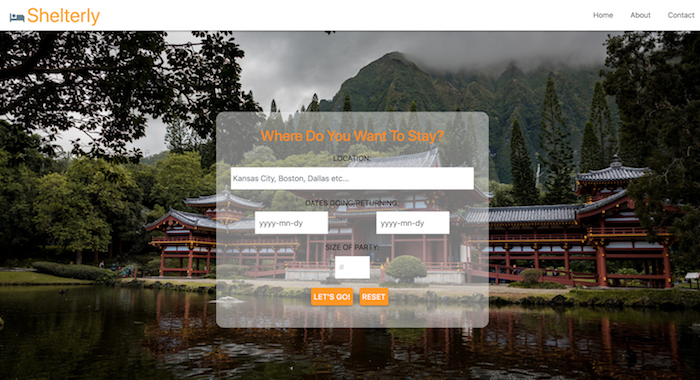

# Shelterly Travel Application
(updated application - former group project)

    </img>

 

# [Live Demo](**insert surge site here**)

 

## Author
Beth D'Amato - [Beth D'Amato](https://github.com/badamato)
Matt Freeman (original API coding) - [Matt Freeman](https://github.com/matthewfreeman821)

 

## Built With

* JavaScript ES5
* jQuery 3.3.1
* Axios
* HTML5/CSS3/Materialize
* [Google Geocoding](https://openweathermap.org/) - Used location API to get coordinates
* [Amadeus](https://api.sandbox.amadeus.com/v1.2/hotels/search-circle) - Amadeus Travel API
* [Google Maps](https://maps.googleapis.com/maps/api/js?key=) - Google Maps API

 

## Development Process
* [Concept](concept)
* [Functionality](functionality)
* [Accessing APIs](accessing-apis)
* [Future Additions](future-additions)

 

### CONCEPT

Lorem ipsum dolor sit amet, consectetur adipiscing elit, sed do eiusmod tempor incididunt ut labore et dolore magna aliqua. Ut enim ad minim veniam, quis nostrud exercitation ullamco laboris nisi ut aliquip ex ea commodo consequat. Duis aute irure dolor in reprehenderit in voluptate velit esse cillum dolore eu fugiat nulla pariatur. Excepteur sint occaecat cupidatat non proident, sunt in culpa qui officia deserunt mollit anim id est laborum.

 

### FUNCTIONALITY

Lorem ipsum dolor sit amet, consectetur adipiscing elit, sed do eiusmod tempor incididunt ut labore et dolore magna aliqua. Ut enim ad minim veniam, quis nostrud exercitation ullamco laboris nisi ut aliquip ex ea commodo consequat. Duis aute irure dolor in reprehenderit in voluptate velit esse cillum dolore eu fugiat nulla pariatur. Excepteur sint occaecat cupidatat non proident, sunt in culpa qui officia deserunt mollit anim id est laborum.

 

### ACCESSING APIs

Lorem ipsum dolor sit amet, consectetur adipiscing elit, sed do eiusmod tempor incididunt ut labore et dolore magna aliqua. Ut enim ad minim veniam, quis nostrud exercitation ullamco laboris nisi ut aliquip ex ea commodo consequat. Duis aute irure dolor in reprehenderit in voluptate velit esse cillum dolore eu fugiat nulla pariatur. Excepteur sint occaecat cupidatat non proident, sunt in culpa qui officia deserunt mollit anim id est laborum.

 

### FUTURE ADDITIONS

If we had more time, we would...

* Access more robust API's for full vacation packages - airfare, hotel, car rental.
* Placement of listing pins on results map.
* Clickable listing cards next to location/map pins that links user to full detail of specific listing.
* "Bookability" for user to place reservation from site.
* Additional site space for user and vendor to message each other.
* Login validation to site.

 

## License 
Copyright 2018 Beth D'Amato
